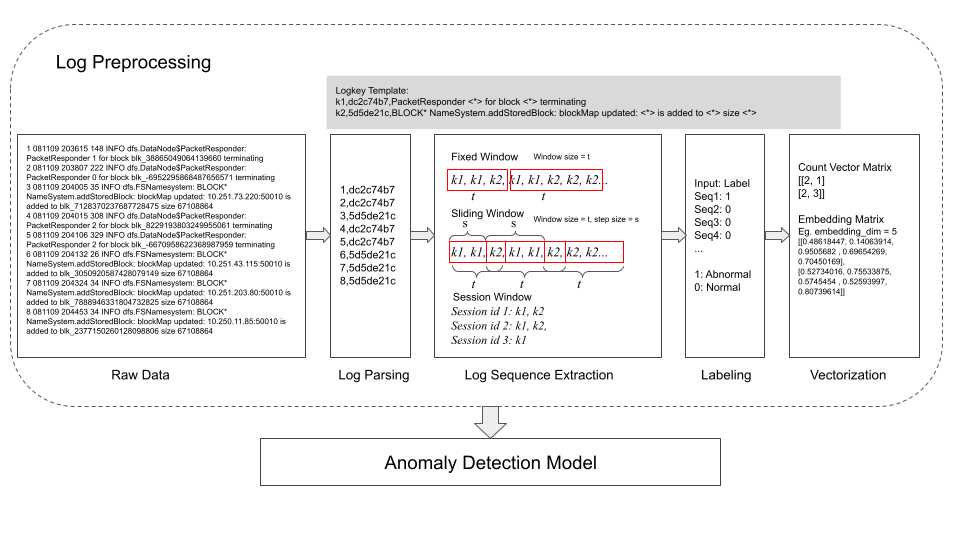

# LogBERT: Log Anomaly Detection via BERT
### [ARXIV](https://arxiv.org/abs/2103.04475) 

This repository provides the implementation of Logbert for log anomaly detection. 
The process includes downloading raw data online, parsing logs into structured data, 
creating log sequences and finally modeling. 



## Configuration
- Ubuntu 20.04
- NVIDIA driver 460.73.01 
- CUDA 11.2
- Python 3.8
- PyTorch 1.9.0

## Installation
This code requires the packages listed in requirements.txt.
An virtual environment is recommended to run this code

On macOS and Linux:  
```
python3 -m pip install --user virtualenv
python3 -m venv env
source env/bin/activate
pip install -r ./environment/requirements.txt
deactivate
```
Reference: https://packaging.python.org/guides/installing-using-pip-and-virtual-environments/

An alternative is to create a conda environment:
```
    conda create -f ./environment/environment.yml
    conda activate logbert
```
Reference: https://docs.conda.io/en/latest/miniconda.html

## Experiment
Logbert and other baseline models are implemented on [HDFS](https://github.com/logpai/loghub/tree/master/HDFS), [BGL](https://github.com/logpai/loghub/tree/master/BGL), and [thunderbird]() datasets

### Run on HDFS Dataset
```shell script

cd HDFS

sh init.sh

# process data
python data_process.py

#run our Experiment 1 on our model
python train_mod.py
------------------------------------------------------
**if you have a trained model already
python val_only_mod.py --experiment 1
------------------------------------------------------
python deploy_mod.py --experiment 1 --threshold {0.-1}

#run logbert
python logbert.py vocab
python logbert.py train
python logbert.py predict

```

### Run on Thunderbird Dataset
```shell script
cd TBird

sh init.sh

# process data
python data_process.py

# run base logbert
python logbert.py vocab
python logbert.py train
python logbert.py predict

# run modified logbert
python train_mod.py
------------------------------------------------------
# if you have a trained model already (runs experiment 1)
python val_only_mod.py --experiment 1
------------------------------------------------------
python deploy_mod.py --experiment 1

```


### Run on BGL Dataset
. Change directory into the `BGL` dataset, then copy and rename `.env_dataset`.
```
cd BGL && cp .env_dataset .env
```

2. Create input and output folders and download datasets by running `init.sh`:
```
sh init.sh
```

3. Preprocess the datasets.
* NOTE: Look out for print statements that indicate what to set `MAX_SEQ_LEN` and `MAX_TOKENS` to.
```
python data_process.py
```

4. If `MAX_SEQ_LEN` is larger than 510, truncate.
```
python truncate_tokens.py
```
**NOTE: This is due to BERT's max token limit being 512, and less 2 to cater for the 2 special tokens ([CLS] and [SEP]).**

5. Train the BERT model.
* NOTE 1: Truncate all sequences in `train`/`test_normal`/`test_abnormal` to a maximum of 510 tokens.
* NOTE 2: Edit `MAX_SEQ_LEN` and `MAX_TOKENS` in `.env`. `MAX_SEQ_LEN` should be at most 510; `MAX_TOKENS` should be the maximum value of any token in `train`/`test_normal`/`test_abnormal`. Run `python get_max_token_and_others.py` to print the `MAX_TOKEN` value.
```
python train_mod.py
```

6. Perform validation.
```
python val_only_mod.py
```

7. Compute metrics.
* NOTE: set `THRESHOLD` in `.env` to output from running `val_only_mod.py`.
```
python deploy_mod.py
```

8. To run the different experiments, edit the `score_batch` function call in `deploy_mod.py` and change the third argument to an integer between 1 to 4 inclusive (corresponding to the experiments below).


### Folders created during execution
```shell script 
~/.dataset //Stores original datasets after downloading
project/output //Stores intermediate files and final results during execution
```

# Experiments Conducted
1. Geometric mean over token probabilities
2. Geometric mean over token anomaly scores (i.e. 1 - probabilities)
3. Harmonic mean between approaches (1) and (2)
4. Approach (3) over only the top 40% most anomalous tokens

# Miscellaneous

## Description of helper scripts
Found in `misc/helper_scripts` folder.
1. `filter_oov....py`: 
- Gets population of tokens from `train` file
- Removes lines from `test_abnormal` and `test_normal` files that have >= 1 token not in the abovementioned population.
- Writes to `test_abnormal_filtered` and `test_normal_filtered`.
- NOTE: Deals with two inputs - one for files formatted as lines of integers (`filter_oov_by_int.py`) and another for those formatted as lines of hexadecimals (`filter_oov_by_hexa.py`).

2. `truncate_tokens.py`:
- Reads in lines from a file - assumes items within line are **space**-separated.
- Truncates lines beyond user-specified limit - this is to deal with BERT max token limitations (512, including special [CLS] and [SEP] tokens).
- Writes to an output file (does not affect original input file).

3. `get_best_threshold.py`:
- Not very useful - to refactor to automatically explore multiple thresholds.
- Currently, just computes F1, Precision and Recall for a user-specified threshold.

4. `get_max_token_and_others.py`:
- Gets the max token value for updating `MAX_TOKENS` value in `.env`. This value represents the vocabulary size for a given `train`/`test_normal`/`test_abnormal` file.
- Gets other measures: number of lines more than a given sequence limit, average length of sequence by number of tokens.

## Set-up using PACE cluster - for GPU compute.
1. Spin up PACE cluster VM and go into it - read GaTech guides if unsure how.
2. Install Visual Studio Code within VM:
```
cd scripts_for_pace
chmod +x setup_for_pace.sh
./setup_for_pace.sh
```
3. Run Visual Studio Code by going into `scripts_for_pace/VSCode-linux-x64` and clicking the executable `code`.

## Set-up for Docker.
1. Set-up Docker container.
- Change directory to folder `docker`: 
```
cd docker
```
- Rename `.env_docker` to `.env`.
- Build Docker container:
```
docker compose build
```
- Run Docker container:
```
docker compose up
```